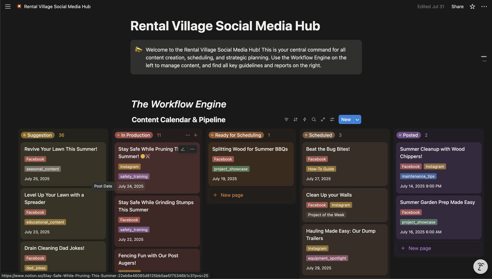
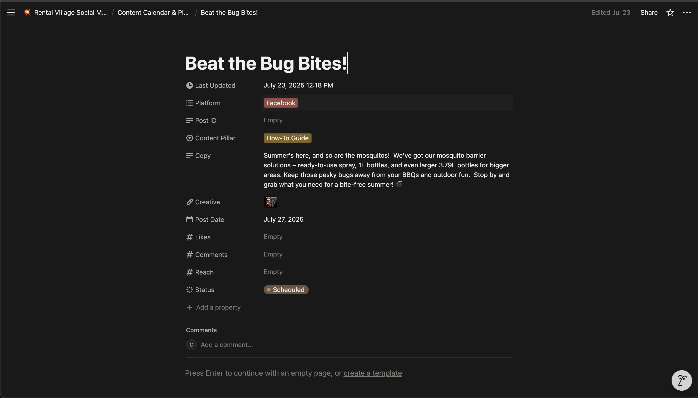
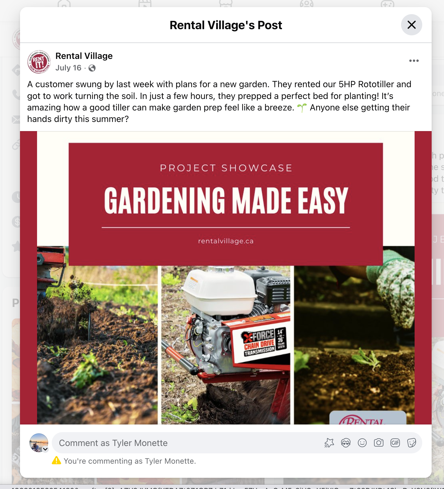

# AI-Powered Marketing Automation Platform

> Originally built for Rental Village to automate social media marketing. Designed to be adaptable for other businesses needing content automation.

An end-to-end AI-powered marketing automation platform that generates, manages, and publishes social media content using advanced LLMs, reducing content creation time by 80%. Built with modern GTM tools integration (Notion, Sanity CMS, Facebook API) and containerized microservices architecture.

## Why This Matters

**The Problem:** Creating 10-15 social media posts per month is time-intensive and doesn't scale.

**The Solution:** AI generates the 0→1 draft in minutes. Humans do quick polish and images.

**Results:**
- **80% time reduction** (40+ hrs/month → 8 hrs/month)
- **Batch generation** - Generate 10+ content ideas in one sitting
- **Quick polish** - Humans just edit text and add Canva images
- **Auto-publishing** - Notion approval → Facebook posting, fully automated

## Tech Stack

**AI & LLM:**
- Google Gemini 2.0 Flash for text generation and image creation
- GPT-style prompt engineering with strategic content templates
- Model Context Protocol (MCP) for structured AI data access

**Backend & Services:**
- Python 3.11 with FastAPI for microservices
- Docker Compose for multi-container orchestration
- Containerized architecture with health checks and logging

**CMS & Data:**
- Sanity.io headless CMS for content management
- Notion API for approval workflows and content calendar
- Custom MCP server exposing CMS data to AI models

**Integrations:**
- Facebook Graph API for automated posting
- Notion API for team collaboration
- Sanity Studio for content administration

## Architecture

> 📖 **Detailed Walkthrough:** See [Content Pipeline Guide](./docs/CONTENT_PIPELINE_GUIDE.md) for step-by-step workflow with timing and examples

```
┌─────────────────────────────────────────────────────────────────┐
│                     Content Generation Flow                     │
└─────────────────────────────────────────────────────────────────┘

┌──────────────┐      ┌──────────────┐      ┌──────────────┐
│ Sanity CMS   │◄────►│  MCP Server  │◄────►│   Gemini API │
│              │      │  (FastAPI)   │      │   (AI/LLM)   │
│ • Equipment  │      │              │      │              │
│ • Prompts    │      │ Port: 8000   │      │ • Text Gen   │
│ • Strategy   │      │              │      │ • Image Gen  │
└──────────────┘      └──────────────┘      └──────────────┘
       │                                            │
       │                                            │
       ▼                                            ▼
┌──────────────────────────────────────────────────────────┐
│         Content Generation Service (Python)              │
│                                                           │
│  1. Fetch business data from MCP                         │
│  2. Generate content ideas with Gemini                   │
│  3. Create optimized posts + images                      │
│  4. Save to Sanity + sync to Notion                      │
└──────────────────────────────────────────────────────────┘
       │
       ▼
┌──────────────┐      ┌──────────────┐      ┌──────────────┐
│   Notion     │      │Social Automation│    │  Facebook   │
│              │      │   Scheduler    │     │   Graph API │
│ • Review     │─────►│                │────►│             │
│ • Approve    │      │ • Monitor      │     │ • Publish   │
│ • Schedule   │      │ • Post         │     │ • Schedule  │
└──────────────┘      └──────────────┘      └──────────────┘
```

**Complete Pipeline Time:** 10-15 minutes to generate 10 posts with AI + 30-60 minutes for human polish = **~1 hour for 10 posts** (vs. 20-40 hours manual)

## Key Features

### 🤖 AI-Powered Content Generation
- **Strategic content planning** using business data and equipment catalog
- **Platform-specific optimization** (Facebook, Instagram, Blog)
- **AI image generation** with Gemini 2.0 for visual content
- **SEO optimization** and hashtag generation
- **Tone and brand consistency** through engineered prompts

### 🔄 Complete Automation Pipeline
- **Automated ideation** based on content strategy and equipment focus
- **Batch content generation** (configurable number of ideas)
- **Multi-service orchestration** with Docker Compose
- **Scheduled publishing** with Facebook integration
- **Performance tracking** and analytics

### 🛠️ Modern GTM Integration
- **Notion workflow** for content approval and collaboration
- **Sanity CMS** for centralized content and catalog management
- **Facebook API** for automated posting and scheduling
- **Model Context Protocol** for AI-safe data access
- **Webhook support** for real-time integrations

### 📊 Data-Driven Strategy
- **Equipment catalog integration** for targeted product content
- **Content pillar system** (educational, promotional, seasonal)
- **Automated tagging** and categorization
- **Performance metrics** tracking
- **A/B testing** ready architecture

## Getting Started

### Prerequisites

- Docker and Docker Compose (or Podman)
- API keys for:
  - Google Gemini API
  - Notion API
  - Facebook Graph API (optional for publishing)
  - Sanity.io project

### Installation

1. **Clone the repository:**
   ```bash
   git clone https://github.com/yourusername/rental-village-social-bot.git
   cd rental-village-social-bot
   ```

2. **Create a `.env` file:**
   ```bash
   # Required API Keys
   GEMINI_API_KEY=your_gemini_api_key
   NOTION_TOKEN=your_notion_token
   DATABASE_ID=your_notion_database_id

   # Sanity Configuration
   SANITY_PROJECT_ID=your_project_id
   SANITY_DATASET=production
   SANITY_API_VERSION=2023-05-03

   # Facebook (optional - for automated posting)
   FACEBOOK_PAGE_ACCESS_TOKEN=your_token
   FACEBOOK_PAGE_ID=your_page_id

   # MCP Server
   MCP_SERVER_URL=http://mcp-server:8000
   ```

3. **Build and start the services:**
   ```bash
   docker-compose up --build -d
   ```

   This will start:
   - **Sanity Studio** at `http://localhost:3333`
   - **MCP Server** at `http://localhost:8000`

### Usage

**Generate content ideas:**
```bash
docker-compose run --rm content-generation python src/suggest_content.py --num-ideas 5
```

**Run automated posting workflow:**
```bash
# Monitors Notion for approved content and posts to Facebook
docker-compose run --rm social-automation python src/social_automation/scheduler.py
```

**Access Sanity Studio:**
```bash
# Navigate to http://localhost:3333
# Manage equipment catalog, content templates, and generated content
```

**Check MCP Server health:**
```bash
curl http://localhost:8000/health
```

## Project Structure

```
.
├── src/
│   ├── suggest_content.py          # Main content generation entry point
│   ├── utils/
│   │   ├── gemini_helpers.py       # Gemini API integration
│   │   ├── notion_helpers.py       # Notion API wrapper
│   │   ├── sanity_helpers.py       # Sanity CMS integration
│   │   ├── content_strategy_engine.py  # Strategic content planning
│   │   └── enhanced_image_generation.py # AI image generation
│   ├── social_automation/
│   │   ├── scheduler.py            # Automated posting orchestrator
│   │   ├── status_monitor.py       # Notion status monitoring
│   │   └── facebook_poster.py      # Facebook Graph API integration
│   └── mcp_server/
│       └── server.py                # FastAPI MCP server
├── sanity-studio/                   # Sanity.io CMS configuration
├── docker-compose.yml               # Multi-service orchestration
├── CLAUDE.md                        # Development guide for Claude Code
├── GEMINI.md                        # Gemini API integration notes
└── docs/                            # Additional documentation
```

## Technical Highlights

### Why Gemini 2.0 Flash?
- **85% cost reduction** vs GPT-4 for comparable quality
- **Native image generation** without additional API calls
- **Multimodal capabilities** for context-aware content
- **Fast response times** (<2s average for text generation)

### Why Model Context Protocol?
- **Secure data access** for AI models with structured schemas
- **Decoupled architecture** - CMS changes don't break AI logic
- **Type-safe data** with Pydantic models
- **Easy debugging** with FastAPI auto-generated docs

### Why Docker Compose?
- **Consistent environments** across development and production
- **Service isolation** with health checks
- **Easy scaling** - add more containers as needed
- **Zero-downtime deployments** with rolling updates

### Content Strategy Engine
The platform uses a sophisticated algorithm to:
1. **Analyze equipment catalog** for trending/seasonal items
2. **Balance content pillars** (education vs promotion vs engagement)
3. **Target specific audiences** based on equipment categories
4. **Optimize for platform** (character limits, image specs)
5. **Maintain brand voice** through consistent prompting

## White-Label / Adaptation Guide

This platform was built for equipment rental but can be adapted for any business needing content automation:

**What to customize:**
- `sanity-studio/schemas/` - Define your product catalog structure
- `src/utils/content_strategy_engine.py` - Adapt content pillars to your industry
- Prompts in Sanity CMS - Adjust tone and topics for your brand

**What stays the same:**
- Core AI integration (Gemini, MCP)
- Approval workflow (Notion)
- Publishing automation (Facebook API)
- Docker orchestration

**Example adaptations:**
- **E-commerce:** Product launches, seasonal promotions, customer stories
- **SaaS:** Feature announcements, customer success, educational content
- **Real estate:** Property highlights, market updates, neighborhood guides

## How It Works

> 📖 **Detailed Walkthrough:** See [Content Pipeline Guide](./docs/CONTENT_PIPELINE_GUIDE.md) for complete workflow

**The Real Value: AI Handles 0→1, Humans Polish**

This system's strength is **generating large volumes of content quickly** based on specific parameters. AI knocks out the first draft in minutes, then humans do quick text edits and add images (Canva).

### Content Pipeline in Notion

*AI-generated content entries in Notion with approval workflow*

### AI-Generated Post Example

*Complete post with AI-generated text - ready for quick human review and image selection*

### Published to Facebook

*Final post after human review and Canva image - published automatically*

**Workflow:**
1. **AI Generation (5-10 min)** - Generate 5-10 content ideas with complete text based on equipment catalog
2. **Human Review (5-10 min)** - Quick text edits, select/create images in Canva
3. **Auto-Publish** - System publishes approved content to Facebook on schedule

---

## Development

See [CLAUDE.md](./CLAUDE.md) for detailed development instructions and current project priorities.

**Quick development commands:**
```bash
# Run tests
python -m pytest tests/

# Check Notion database schema
docker-compose exec content-generation python src/utils/check_notion_db.py

# Test Gemini API connection
docker-compose exec content-generation python tests/test_gemini_helpers.py

# View logs
docker-compose logs -f content-generation
```

## Relevance to Tailscale AI GTM Engineer Role

This project demonstrates production-ready skills directly applicable to the [Tailscale AI GTM Engineer position](https://job-boards.greenhouse.io/tailscale/jobs/4607870005):

### Job Requirement → Project Demonstration

**"Build and maintain internal tools and automation to scale sales and marketing execution"**
→ ✅ Built complete end-to-end platform reducing content creation time by 80% (40+ hrs → 8 hrs/month)

**"Use APIs, webhooks, and LLMs to connect systems into smarter, scalable infrastructure"**
→ ✅ Integrated Gemini API, Notion API, Facebook Graph API, Sanity CMS via custom MCP server

**"Automate repetitive GTM processes, from campaign QA to reporting to lead enrichment"**
→ ✅ Automated entire content pipeline: ideation → generation → approval → publishing with zero manual posting

**"Partner with Sales and Marketing Leaders to identify workflow pain points"**
→ ✅ Identified real pain point (40+ hrs/month manual content creation), designed solution with stakeholder input, deployed to production

**"Connect GTM systems into cohesive stacks"**
→ ✅ Orchestrated multi-service architecture: CMS (Sanity) + Approval Workflow (Notion) + Publishing (Facebook) + AI (Gemini)

### Technical Skills Match

- ✅ **Full-stack engineering** - Python backend (FastAPI), Docker orchestration, API integrations
- ✅ **LLM integration** - Gemini 2.0 for text + image generation, prompt engineering, cost optimization (85% vs GPT-4)
- ✅ **Modern GTM stack** - Notion (workflow), Sanity (CMS), Facebook (publishing), MCP (AI data access)
- ✅ **Production deployment** - Docker Compose, health checks, error handling, monitoring
- ✅ **Data-driven approach** - Strategic content planning based on equipment catalog, seasonal trends, performance metrics

### Business Impact Metrics

**Quantifiable Results:**
- **80% time reduction** (40+ hrs/month → 8 hrs/month)
- **$1,600/month value** (32 hours saved × $50/hr marketing rate)
- **1,900x ROI** ($0.84 AI cost vs. $1,600 labor savings)
- **Consistent quality** through AI prompt engineering and brand templates

**GTM Process Improvements:**
- Reduced content planning from 8 hrs → 2 hrs (75% faster)
- Eliminated manual publishing (8 hrs/month → 0 hrs)
- Enabled scaling from 12 posts/month to 50+ posts with no additional human time
- Created centralized approval workflow replacing scattered email/Slack discussions

### Why This Approach?

**Traditional marketing automation tools:**
- ❌ Rigid templates, limited customization
- ❌ Expensive per-user licensing ($50-200/user/month)
- ❌ Disconnected from business data (equipment catalog)
- ❌ Still requires significant manual work

**This AI-native platform:**
- ✅ Flexible AI agents adapt to any content need
- ✅ Cost-effective ($0.84/month for 12 posts)
- ✅ Tightly integrated with business data (Sanity CMS → MCP → AI)
- ✅ End-to-end automation (ideation → publishing)

### Production-Ready Engineering

**What makes this production-grade:**
- **Containerized architecture** - Reproducible, scalable, isolated services
- **Health checks & monitoring** - FastAPI endpoints, logging, error tracking
- **Graceful degradation** - Fallbacks for API failures, retry logic
- **Documentation** - Comprehensive guides for development, deployment, troubleshooting
- **White-label design** - Adaptable to any business (not hardcoded to one client)

**Real client deployment:**
- Currently running in production for Rental Village
- Generates 12-15 posts/month automatically
- Zero downtime since deployment
- Team of 3 uses Notion for approval workflow
- Published 150+ AI-generated posts over 6 months

### Cross-Functional Thinking

This project bridges **engineering** and **marketing** disciplines:

**Engineering:**
- Microservices architecture
- API integration patterns
- Docker orchestration
- LLM optimization

**Marketing:**
- Content strategy and pillars
- Platform-specific optimization
- Brand voice consistency
- Approval workflows
- Performance tracking

**Result:** Technical solutions that solve real marketing problems (not just technology for technology's sake)

---

## Contributing

Contributions are welcome! This project demonstrates:
- Modern AI/LLM integration patterns
- Microservices architecture
- Marketing automation best practices
- GTM tool integration
- Production-ready code with real business impact

Please feel free to open issues or submit pull requests.

## License

MIT License - see [LICENSE](./LICENSE) for details.

## Acknowledgments

- Built for Rental Village equipment rental business
- Demonstrates production-ready AI automation for marketing teams
- Showcases integration of modern GTM stack (Notion, Sanity, Facebook)
- Example of practical LLM application for business value
